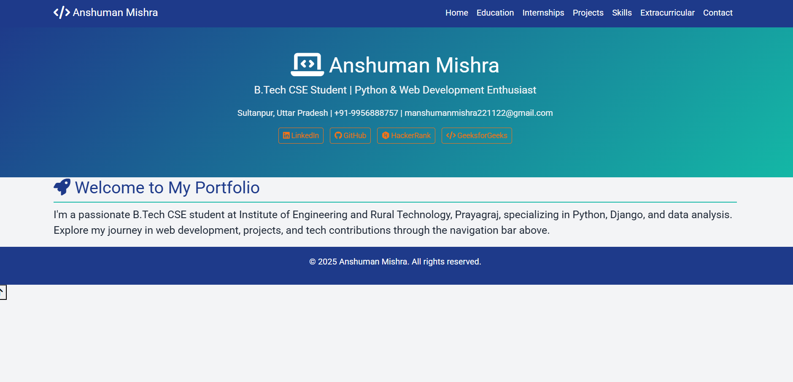
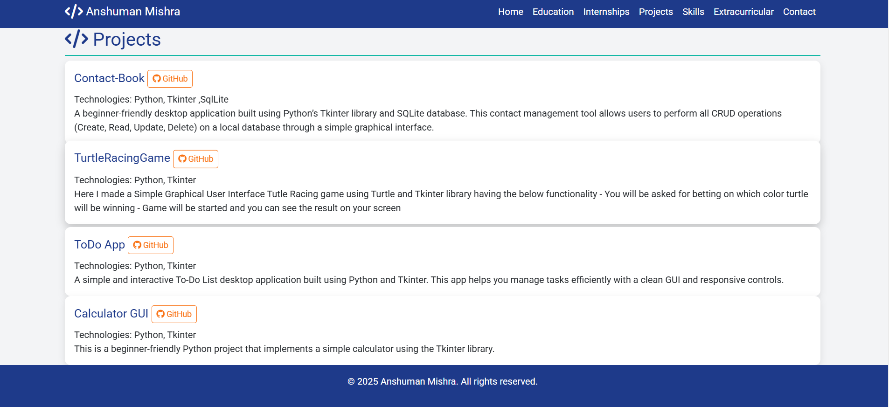
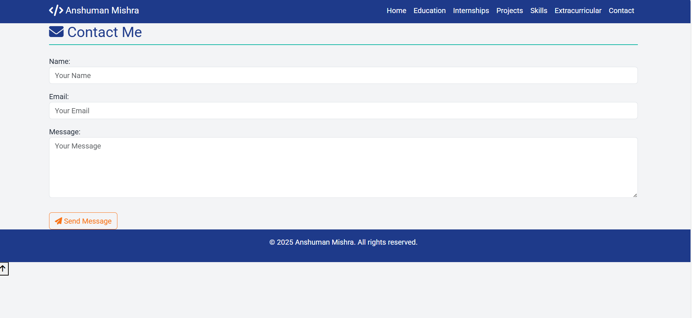

# 🧑‍💻 Anshuman Mishra's Portfolio

Welcome to my **personal portfolio website**—a full-stack Django web application reflecting my academic and professional journey as a B.Tech Computer Science and Engineering student at the **Institute of Engineering and Rural Technology, Prayagraj**.

> 🎯 This project encapsulates my educational background, internships, technical projects, skills, extracurricular activities, and provides a dynamic contact mechanism for networking and collaboration.

---

## 🌟 Features

###  Multi-Page Architecture
- **Home**
- **Education**
- **Internships**
- **Projects**
- **Technical Skills**
- **Extracurricular Activities**
- **Contact Form**

### 🎨 Vibrant UI/UX
- Tech-themed color palette

- Smooth scrolling & scroll-triggered animations (`Animate.css`)
- Gradient hover effects and parallax-style headers
- Responsive mobile-first design (`Bootstrap 5.3.3`)

### 📬 Functional Contact Form
- Validated input
- Submissions stored in the database
- Admin-accessible logs

### 🧩 Tech Stack

| Layer       | Technologies                                   |
|-------------|------------------------------------------------|
| **Backend** | Django 4.x, Python 3.x                         |
| **Frontend**| HTML5, CSS3, Bootstrap 5, Animate.css, JS      |
| **Database**| SQLite (extensible to PostgreSQL/MySQL)        |
| **Admin**   | Django Admin Panel for full CRUD management    |

---

## 📸 Screenshots


| Page | Preview |
|------|---------|
| Home |  |
| Projects |  |
| Contact |  |

---

## 🛠️ Installation Guide

### 🔧 Prerequisites
- Python 3.8+
- Git
- Virtualenv *(Recommended)*
- SQLite (included with Python)

---

### 🧪 Local Setup

```bash
# Step 1: Clone the Repository
git clone https://github.com/01Anshuman/My-Portfolio-Website.git
cd My-Portfolio-Website

# Step 2: Create and Activate Virtual Environment
python -m venv venv
source venv/bin/activate  # Windows: venv\Scripts\activate

# Step 3: Install Required Packages
pip install -r requirements.txt

# Step 4: Apply Migrations
python manage.py makemigrations
python manage.py migrate

# Step 5: Collect Static Files
python manage.py collectstatic

# Step 6: Create Superuser
python manage.py createsuperuser

# Step 7: Run the Development Server
python manage.py runserver
